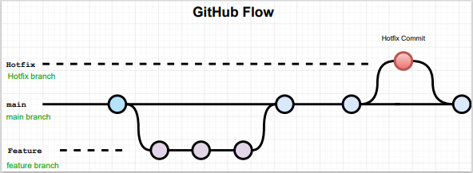

# CMPG-323-Overview-31958435

<h2>Project Repository Context Diagram</h2>

 

Project 2 Repository - API Development  
Project 3 Repository - Standards and Patterns   
Project 4 Repository - Testing & RPA   
Project 5 Repository - Reporting and Monitoring   
  
Each Project will have its own repository and all the project will be linked to the overview repository. Only project 2 API - development will be linked to project 5 where the endpoints created in project 2 will be used to visualise the data.

<h3>Project Repository links <h2>

<h2>Branching Strategy</h2>

 

main branch - The default branch (long running branch)  
Feature branch - Feature branch will implement features and merged back into the main branch. Then Deleted (short running branch)  
Hotfix branch - hotfix branch will be used to change code already merged into the main branch and merged back into the main branch (short running branch).

GitHub flow comprises of main and features branches, but I also added a hotfix branch that stems directly from the main branch for small tasks that necessarily do not have to be feature.

The main idea behind using the GitHub Flow branching strategy was to isolate work in progres from the completed work in the main branch. 

<h2>How to use the .gitignore file</h2>

The .gitignore file will be used to ignore/not-track files or directories in our repositories, such as crendentials, artificats, language files, and packaging managers.

<h2>How Credential will be stored</h2>

Credential (username, password, api_key, token) will be stored in a dotenv (.env) file separate from the code. The .env method lets the application load varibles from .env file into the running process.

<h2>Acknowledgements</h2>
<ul>JacquiM</ul> 
<ul>autoruby</ul>
<ul>marijkec</ul>

<h2>License</h2>

MIT

